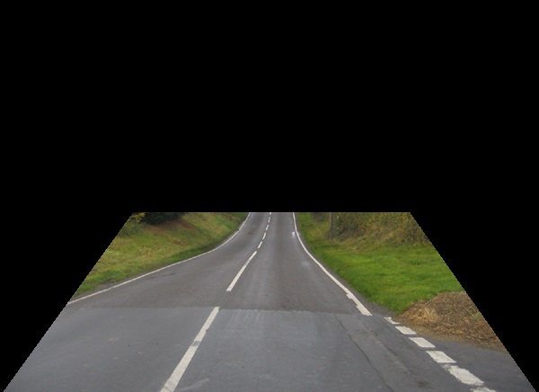

# Lane Detection Project
<h3>A Project created for Giscle Internship</h3>

<h5>Team leader: Olaf Placha 
Other team members: Ahmet Yaylalioglu, Prashant Singh, Prashant Shukla</h5> 

The Pipeline

First we apply ROI mask to get rid of the objects at the top or on the sides of the road. We focus only on the road

